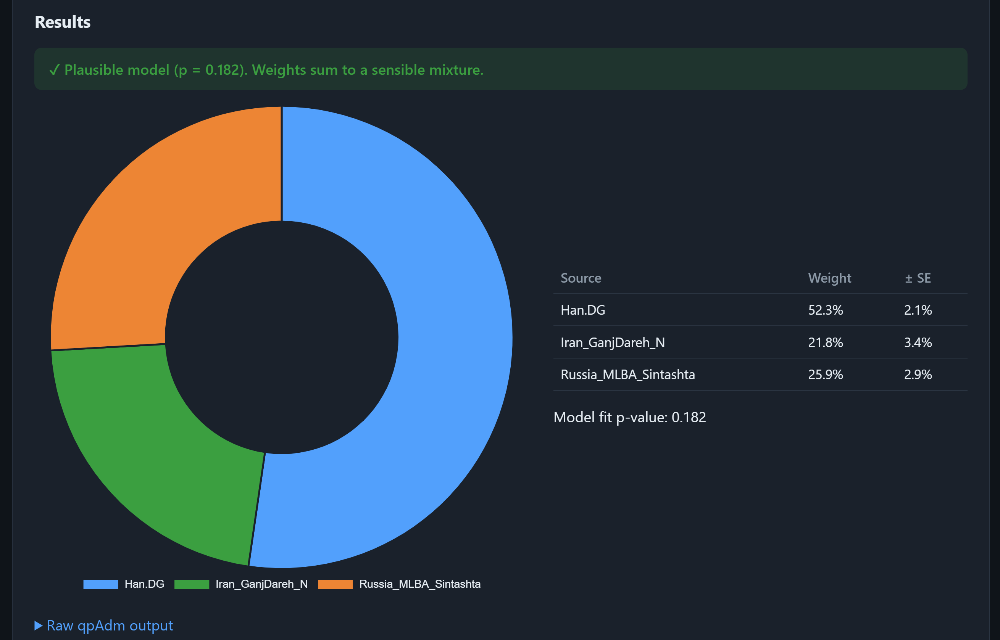

# qpAdm web

A small **web app** that estimates your genetic ancestry as a mixture of ancient
populations. You upload a consumer DNA file (LivingDNA, 23andMe, MyHeritage, …),
choose which populations to model, and the app runs the
[qpAdm](https://github.com/DReichLab/AdmixTools) workflow and shows the result
as a chart you can actually read.

It replaces the old Colab notebook (`qpAdm_livingDNA.ipynb`, kept for reference)
with a reusable, parameterised tool.



*Example: a sample modelled as 52% Han + 22% Iran Neolithic + 26% Sintashta,
with a model-fit p-value of 0.182 (a plausible model).*

---

## Table of contents

1. [What it does](#what-it-does)
2. [qpAdm in plain English (target / left / right)](#qpadm-in-plain-english)
3. [Try it now without any data](#try-it-now-without-any-data)
4. [Setup — Docker (recommended)](#setup--docker-recommended)
5. [Download the reference data](#download-the-reference-data)
6. [Using the app, step by step](#using-the-app-step-by-step)
7. [Reading the results](#reading-the-results)
8. [Setup — manual (no Docker)](#setup--manual-no-docker)
9. [Project layout](#project-layout)
10. [Caveats](#caveats)

---

## What it does

Behind the scenes it runs the standard ancient-DNA pipeline for you:

```
your DNA text  ──plink──▶  PLINK binary  ──plink --set-hh-missing──▶  cleaned
   └──convertf──▶  EIGENSTRAT  ──mergeit (+ reference panel)──▶  merged
                                                        └──qpAdm──▶  ancestry model
```

You don't run any of these commands by hand — upload, click **Run**, and the app
orchestrates `plink → convertf → mergeit → qpAdm`, then parses the output into a
chart, a table with standard errors, and a plain-language verdict.

---

## qpAdm in plain English

qpAdm answers one question: **"Can my sample be explained as a mixture of these
candidate ancestral populations, and if so, in what proportions?"**

To ask it, you give the app three things:

| Term | What it is | In this app |
|------|-----------|-------------|
| **Target** | The population you want to explain — i.e. **you**. | Your uploaded DNA, given the *Sample label* you type. |
| **Left / source populations** | The candidate ancestral ingredients you think your target is a mixture of (e.g. a Neolithic Iranian group + a Steppe group + an East Asian group). | The **Source populations** box. |
| **Right / reference populations** | A "backdrop" of populations (often called **outgroups**) that are differently related to your sources. qpAdm uses them to tell the sources apart. They should *not* be recent relatives of your sources. | The **Reference populations** box. |

Think of it like mixing paint: the **sources** are the candidate base colours, the
**target** is the colour you ended up with, and the **references** are a set of
known reference swatches that let the method measure how much of each base colour
went in.

**Rules of thumb**
- Put **more references (right) than sources (left)** — that's what gives qpAdm
  the statistical power to resolve the mixture. A common setup is 2–4 sources and
  6–10 references.
- Good references are deeply diverged, well-sampled populations (e.g. `Mbuti.DG`,
  `Russia_Ust_Ishim_HG.DG`, `Karitiana.DG`, `Papuan.DG`, `Onge.DG`).
- If a model **fails** (low p-value), it usually means your chosen sources or
  references don't suit your ancestry — change them and try again. Modelling is
  iterative.

The exact population names must match those in the reference panel (see
[Download the reference data](#download-the-reference-data)). The app ships with
sensible West-Eurasian-style defaults pre-filled in both boxes so you have a
working starting point.

---

## Try it now without any data

You don't need the (large) reference dataset to see the results UI. The app can
visualise an **existing qpAdm log**, and a demo one ships in the repo.

1. Start the app (Docker or manual — see below).
2. Open <http://127.0.0.1:8000>.
3. Under **"2 · Visualise an existing log"**, upload
   [`examples/sample_qpadm.log`](examples/sample_qpadm.log).
4. You'll get the screen shown at the top of this README.

This exercises the parsing + visualisation half end-to-end. Running your *own*
DNA additionally needs the tools + reference data below.

---

## Setup — Docker (recommended)

The Docker image **compiles AdmixTools and bundles PLINK 1.9 for you**, so the
only thing you provide is the reference panel. This is by far the easiest path,
especially on Windows (AdmixTools doesn't compile natively on Windows).

**Prerequisites:** [Docker Desktop](https://www.docker.com/products/docker-desktop/).

```bash
# 1. Create the data folders
mkdir -p data/reference data/workdir

# 2. Put the reference panel trio in data/reference/  (see next section)
#    data/reference/v54.1.p1_1240K_public.geno
#    data/reference/v54.1.p1_1240K_public.snp
#    data/reference/v54.1.p1_1240K_public.ind

# 3. Build (first build compiles AdmixTools — a few minutes) and run
docker compose up --build
```

Open <http://127.0.0.1:8000>. Once the data is in place, the **Environment**
panel shows all green and the **Run** button activates. Results and intermediate
files persist in `data/workdir`.

> If your panel files use a different prefix than `v54.1.p1_1240K_public`, set
> `REFERENCE_PREFIX` in [`docker-compose.yml`](docker-compose.yml) to match.

---

## Download the reference data

qpAdm compares your sample against a panel of present-day and ancient
populations. The standard panel is the **Allen Ancient DNA Resource (AADR)** from
the Reich Lab. It is **large (several GB)** and has **its own terms of use —
please review them.** You only download this once.

**Where to get it:**

- **Harvard Dataverse (official):**
  <https://dataverse.harvard.edu/dataset.xhtml?persistentId=doi:10.7910/DVN/FFIDCW>
- **AADR landing page (overview + links):**
  <https://reich.hms.harvard.edu/allen-ancient-dna-resource-aadr-downloadable-genotypes-present-day-and-ancient-dna-data>
- **Direct mirror (the version the old notebook used):**
  ```bash
  cd data/reference
  wget https://reichdata.hms.harvard.edu/pub/datasets/amh_repo/curated_releases/V54/V54.1.p1/SHARE/public.dir/v54.1.p1_1240K_public.tar
  tar -xvf v54.1.p1_1240K_public.tar
  ```

**What you actually need:** the app uses only the **EIGENSTRAT trio**:

| File | Contents |
|------|----------|
| `<prefix>.geno` | the genotype matrix |
| `<prefix>.snp`  | the SNP positions |
| `<prefix>.ind`  | the individuals and which population each belongs to |

You can ignore the `.anno` and other files if you want to save space — though the
`.anno` / `.ind` file is the handy place to **look up valid population names** for
the Source/Reference boxes.

**Which version?** Any AADR release works; newer ones (v62+, etc.) simply have a
different file prefix. Whatever you download, make `REFERENCE_PREFIX` match the
file names. There are two panel types:
- **1240K** — ~1.2M SNPs, includes low-coverage ancient samples (use this).
- **HO (Human Origins)** — fewer SNPs, more present-day populations.

---

## Using the app, step by step

1. **Upload your DNA file** — the raw text export from LivingDNA / 23andMe /
   MyHeritage (a `.txt` of `rsID  chromosome  position  genotype`).
2. **Sample label** — any name for your sample (e.g. `Me`). It becomes the
   target population name.
3. **Source populations** — one population name per line: the ancestral
   ingredients to model (the *left* set).
4. **Reference populations** — one per line: the outgroup backdrop (the *right*
   set). Use more of these than sources.
5. Click **Run qpAdm**. A progress bar tracks the steps
   (`import → clean → convertf → mergeit → qpAdm`). A typical run takes a few
   minutes because the reference panel is large.
6. The **Results** section appears with the chart, table, verdict and raw log.

---

## Reading the results

- **Verdict** — green means the model is *plausible*; red means it's a *poor fit*.
- **p-value (tail probability)** — the conventional reading: a model is plausible
  when **p > 0.05**. A very small p-value means this combination of sources can't
  explain your sample well.
- **Weights** — the estimated ancestry proportion from each source (they sum to
  ~100%). Sensible weights stay within roughly 0–100%; large negative or
  over-100% weights signal a bad model.
- **± SE (standard error)** — the uncertainty on each weight. Big error bars mean
  the estimate is shaky; treat exact percentages as estimates, not facts.
- **Raw qpAdm output** — the full log, for anyone who wants the underlying numbers.

If a model fails, iterate: swap sources, add/remove references, or simplify from a
3-way to a 2-way mixture.

---

## Setup — manual (no Docker)

For Linux/macOS (or Windows via WSL), if you'd rather not use Docker.

You must provide the tools yourself:
- **AdmixTools** binaries (`convertf`, `mergeit`, `qpfstats`, `qpAdm`) — build
  from [DReichLab/AdmixTools](https://github.com/DReichLab/AdmixTools).
- **PLINK 1.9** — prebuilt binaries at <https://www.cog-genomics.org/plink/1.9/>.

```bash
python -m venv .venv
source .venv/bin/activate        # Windows: .venv\Scripts\activate
pip install -r requirements.txt

cp .env.example .env             # then edit the paths below
uvicorn app.main:app --reload
```

`.env` settings:

| Variable           | Meaning                                                        |
|--------------------|---------------------------------------------------------------|
| `ADMIXTOOLS_BIN`   | Folder with the AdmixTools binaries (blank = search `PATH`)    |
| `PLINK_BIN`        | Path to `plink` (blank = search `PATH`)                        |
| `REFERENCE_DIR`    | Folder holding the reference panel trio                        |
| `REFERENCE_PREFIX` | Panel file-name prefix (default `v54.1.p1_1240K_public`)       |
| `WORK_DIR`         | Where uploads / intermediates / results go (default `workdir`) |

The app **degrades gracefully**: if tools or data are missing, the Environment
panel says exactly what's absent and disables *Run*, but *Visualise an existing
log* still works.

---

## Project layout

```
app/
  config.py     environment + path resolution (from .env)
  models.py     request/response schemas
  parsers.py    tolerant qpAdm log parser
  pipeline.py   plink/convertf/mergeit/qpAdm orchestration
  jobs.py       background-thread job manager
  main.py       FastAPI routes
  templates/    index.html
  static/       app.js, style.css
examples/
  sample_qpadm.log   demo log for the visualiser
tests/
  test_parsers.py
Dockerfile, docker-compose.yml   reproducible run with tools baked in
```

Run the parser tests with `python tests/test_parsers.py`.

---

## Caveats

- A single uploaded individual is **one sample**. Some f2-based statistics are
  unreliable for single-sample populations, so lean on the p-value and standard
  errors rather than chasing exact percentages.
- qpAdm results depend heavily on your choice of sources and references —
  treat them as **hypotheses you test**, not definitive ancestry readouts.
- The AADR reference data is governed by its own license; this repository does
  not redistribute it.

---

## References

1. [AdmixTools](https://github.com/DReichLab/AdmixTools)
2. [Allen Ancient DNA Resource (AADR)](https://reich.hms.harvard.edu/allen-ancient-dna-resource-aadr-downloadable-genotypes-present-day-and-ancient-dna-data)
   · [AADR on Harvard Dataverse](https://dataverse.harvard.edu/dataset.xhtml?persistentId=doi:10.7910/DVN/FFIDCW)
3. [PLINK 1.9](https://www.cog-genomics.org/plink/1.9/)
4. [Original notebook on Google Colab](https://colab.research.google.com/drive/1ZJM2iefEgxJp0mZUsDZZteBQL0Zd4L_r?usp=sharing)
